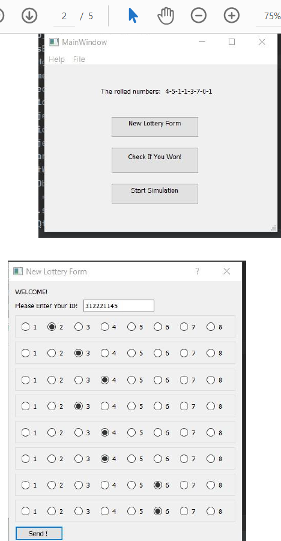
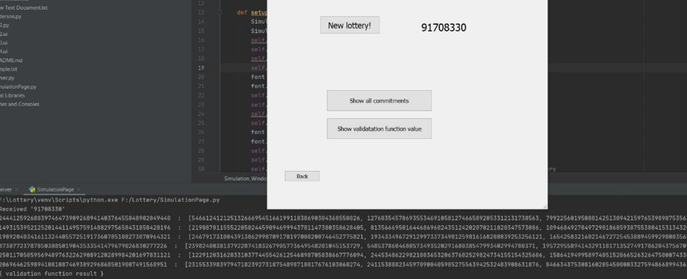

## General info
The lottery company receives the ID and the user's guess as an
encrypted message (for reasons of privacy and reliability), after the
lottery results are published, the user can send his unique "secret"
to decrypt the message and prove his winning the lottery.

## Screenshots

## Implemented
* Encryption
* TCP sockets

## Setup
-pip install Crypto
-pip install pycryptodome==3.4.3
-pip install PyQt5
-pip install pyqt5-tools

-Run Server.py
-Run the mainp.py
-Run SimulationPage.py